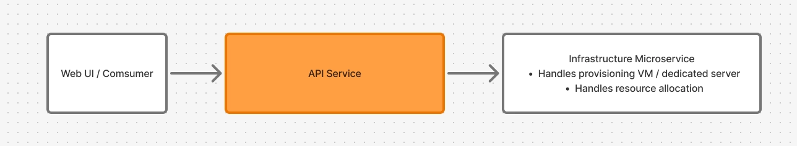

# Back-end

**Time:** Task should be done in 2-3 hours

**Stack allowed:** Go (Preferred: Go Fiber) or Node (Preferred: Express and Elysia, on any runtime)

**Tools:** AI Assistants (both tabs auto completion and coding assistant) are allowed and encouraged. However, you have to own and understand your submitted code

**Supplemental Files:** https://github.com/CLOUDFOREST-CO-TH/interview-supplemental-files

---

# Task Overview

You are building a RESTful API Service to manage Cloud Servers that orchestrates actions between your internal data store and an external infrastructure micro-service.

## Task 1: **Database Design**

Create a Markdown file defining the data schema for this application.  
**→ Schema document:** [docs/DATABASE_SCHEMA.md](docs/DATABASE_SCHEMA.md) You can define the fields and data types as you see fit, but the following requirements must be met:

- **Users:** Must store credentials for authentication (Email and Password).
- **Servers:** Must store the server's power status (e.g., On/Off) and the SKU (e.g., “C1-R1GB-D40GB” for 1 core CPU, 1 GB RAM, 40 GB Disk).
    - Critical Requirement: When a server is provisioned, the infrastructure micro-service issues a unique **Infrastructure Resource ID**. You must design the schema to store this ID so the server can be managed later. This Infrastructure Resource ID shouldn’t be use as Server ID on API Service side.
- **ActivityLogs:** Must act as an audit trail for actions performed via the API.

<aside>
ℹ️

**Note on Implementation:** For the coding portion (Task 2 and Task 3), you will not need a real database. You will implement this design using simple in-memory storage (e.g., Go Structs or JS Objects). Design your schema with this simplicity in mind.

</aside>

## Task 2: Endpoints Implementation

Build the RESTful API using Go (Preferred: Fiber) or Node (Preferred: Express or Elysia).

- **Data Storage:** Use simple in-memory storage (e.g., Global Structs/Objects/Arrays). **No real database is required.**
- **Middleware:** Implement JWT Authentication and CORS (allow only `localhost:3000`).

**Prerequisites:**

Before starting, download the **Mocked Infrastructure Microservice** from https://github.com/CLOUDFOREST-CO-TH/interview-supplemental-files (/backend dir) and run it on your machine at port `:8081` (`go run backend/go/server.go` or `node backend/node/server.mjs`). Your API will need to make HTTP requests to this service to provision and manage servers. See `swagger.yaml` for API docs.

**Endpoints:**

1. **Authentication**
    
    **POST /auth/login**
    
    - **Behavior:** Authenticate the user and issue a JWT token in an `HttpOnly` cookie.
    - **Seed Data:** Your application should be pre-loaded with this user:
        - **User ID:** `123123123`
        - **Email:** `john.smith@gmail.com`
        - **Password:** `not-so-secure-password`
2. **Server Management (Protected)**
    
    **These endpoints must check for a valid JWT and enforce CORS.**
    
    **GET /servers**
    
    - **Description:** List all servers belonging to the authenticated user.
    
    **POST /servers**
    
    - **Description:** Provision a new server. This must call the Mock Infrastructure Service to get a Infrastructure Resource ID, then save the server details to your in-memory store.
    - **Request Body:** `{ "sku": "C1-R1GB-D40GB" }`
    - **Response:** `{ "success": true, "id": "<Infrastructure Resource ID>" }`
    - **Error Handling:**
        - Validate sku against this list using microservice API `/v1/skus`. Return a proper HTTP status when the data is malformed or invalid.
    
    **POST /servers/:server-id/power**
    
    - **Description:** Change the power state of a server. You must look up the server's Infrastructure Resource ID and call the Mock Service to apply the change.
    - **Request Body:** `{ "action": "on" }` or `{ "action": "off" }`
    - **Response:** `{ "success": true, "state": "on" }`
    - **Error Handling:**
        - Handle error cases, like server ID not found using proper HTTP statuses.

## Task 3: Real-world Case

You may notice that the **Mocked Infrastructure Microservice** is intentionally flaky. It sometimes responds slowly or returns errors. In the real world, we must build resilient services that handle these failures gracefully.

**Requirement:**

Modify your implementation to handle these external failures **OR** if your time is limited, provide a design docs in Markdown.

- You may add/modify the database schema, endpoint logic, or response structure as needed.
- The solution should be robust but not over-engineered. (e.g. You don't need a full-blown message queue like Kafka, but you should be able to explain the rationale behind that).

**Questions to consider while implementing:**

- What happens if the external service is down during provisioning?
- How do you ensure the user isn't stuck waiting indefinitely?

# Submission Guidelines

There are two ways to submit your work.

1. Push your code to a public repository on GitHub or GitLab and send the link to the email.
    1. Include a clear `README.md` with:
        - Instructions on how to install dependencies and run the project locally. Including Task 1 Markdown.
        - (Optional) If you chose the "Design Doc" route for Task 3, include it here.
2. Or via Email: .zip file and send the file back to the email.